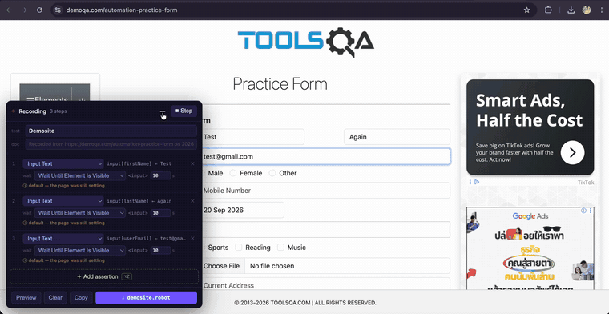

# Zelector



Record a flow, or pick any element — closed shadow roots included — and get
selectors scored on how likely they are to survive the next deploy. A recording
becomes a Robot Framework suite; a single pick copies as Robot Framework,
Selenium (Python or Java), CSS, XPath or JSON.

Free, MIT, no account, no servers — [nothing leaves the browser](PRIVACY.md).

## Why

Right-click, Copy selector, and Chrome hands you `div > div:nth-child(3) > button`.
That dies the moment somebody wraps the button in a flex container. DevTools has no
opinion on which selectors last, and it can't help at all when the element is behind
a hover menu that closes the second you reach for DevTools, or inside
`#shadow-root (closed)`.

Zelector freezes the DOM to hold those menus open, walks closed shadow roots through
an `attachShadow` hook installed at `document_start`, and penalises generated class
names (`css-1x9d8f`, `Button_root__3kD9a`, `_ngcontent-…`) instead of offering them
as if they were stable.

## Record a flow

Click the toolbar icon and pick **Record a flow**, or press `⌥⇧R`. Use the page the way you normally would — clicks, typing
and dropdowns are captured, keystrokes collapse into one `Input Text`, and a
click on a `<span>` inside a button records the button.

What it does not do is ask you to choose a wait every time you click. That
interrupts the flow you are reproducing, and worse, folds your thinking time
into the timings it is measuring. Instead it watches what the page actually did
— which request fired, what appeared, what appeared and then vanished — and
proposes a wait per step, with the reason attached:

```
3  Click Button ▾   button[export-csv]
   wait  Wait Until Element Is Not Visible ▾  <div>  15s
   ⓘ after POST /api/export (780ms), <div> appeared then went away
```

Every row is editable, so you fix the two the recorder got wrong instead of
answering twenty prompts. The suite comes out as a `.robot` file — named after
the test — or on the clipboard. Timeouts come from the time the page actually took,
not a default nobody tunes. `Sleep` is in the dropdown, last, with a warning —
hiding it just means people type it back in by hand.

Assertions are the part no recorder can capture by watching, so the panel keeps
a **＋ Add assertion** button on screen: it opens the picker, and the keyword
list becomes the list of assertions you can append.

The awkward things are recorded too, because leaving them out is how a suite
comes to hang on something it never mentions:

| | |
|---|---|
| `alert` / `confirm` / `prompt` | `Handle Alert`, `Input Text Into Alert` — browser chrome, so there is no element to pick and no event to listen for |
| Enter, Escape | `Press Keys` — a search submitted from the keyboard replays as one |
| dragging | `Drag And Drop`, both ends, rather than a click on whichever the browser fired one over |
| a drag the browser runs | `draggable="true"` hands the gesture to the browser and pointer events stop arriving, so a kanban board recorded as nothing at all. It comes out as a keyword that dispatches the drag events, because Chrome does not turn Selenium's pointer actions into a native drag either |
| hover menus | `Mouse Over`, whether the menu is opened by script or by a `:hover` rule that moves no nodes at all |
| file pickers | `Choose File`, with the chosen name in a comment — the browser will not say where the file came from |
| a URL typed by hand | `Go To`, since nothing clicked led there |
| double click, right click | `Double Click Element`, `Open Context Menu` — gestures the picker cannot offer for an element you have merely pointed at |
| a rich text editor | the keystrokes, as `Press Keys`. A contenteditable is not a field: it has no value, `Input Text` refuses it, and TinyMCE, CKEditor, Quill and ProseMirror all put one on the page. A recording of one used to come out empty — no error, no step, no sign anything had happened |
| a multiple select | one step carrying every label, because `change` fires per option and a `<select multiple>` does not accumulate across calls |
| a sticky header or ad footer | one `Bring Into View` keyword, called before each click on that page: it waits for the element to hold the same box for two frames *on screen*, then centres it. WebDriver scrolls an element the smallest distance that puts it in the viewport, which parks it against the edge the bar is pinned to — and a banner that is still sliding is displayed long before it is where the click will land |
| the window it was recorded in | `Set Window Size`, because `Maximize Browser Window` does nothing in headless Chrome, and a page is a different page at 800px: data.go.th folds its navigation into a hamburger and the recorded link is not rendered at all |

The suite it writes opens the browser in `Suite Setup`, tags the test with
`recorded` and the site it came from, and waits for the page to stop rewriting
itself before the first step — a React site hydrates after it loads and
replaces the nodes it just rendered, which took out two runs in three on Ant
Design's form page.

The recording survives navigation: it lives in the service worker, and the new
page picks it back up — which also turns the click that navigated into a
`Wait Until Location Contains`.

The panel has a **test** and a **doc** field. The name is seeded from the page
title and becomes the test case heading; the doc becomes its `[Documentation]`,
defaulting to where and when the flow was recorded — which is the question
anyone reading a generated suite six months later actually has.

Output is a full suite: one keyword per element, each waiting for its own
element, with the flow-level waits left visible in the test case. Clicking the
same button twice defines one keyword, not two. It opens with
`Maximize Browser Window`, because a default-sized window puts anything below
the fold under a sticky footer and Selenium then reports "element click
intercepted" for a page that works perfectly by hand.

## Install (dev)

```bash
npm install
npm run dev        # rebuilds dist/ on change
```

`chrome://extensions` → Developer mode → Load unpacked → pick `dist/`.

## Shortcuts

| macOS | Windows / Linux | |
|---|---|---|
| `⌥` `⇧` `R` | `Alt` `Shift` `R` | start / stop recording |
| `⌥` `Z` | `Alt` `Shift` `Z` | toggle the picker |
| `⌥` `⇧` `F` | `Alt` `Shift` `F` | freeze the DOM |
| `↑` `↓` | `↑` `↓` | walk the selection up/down the tree |
| `Esc` | `Esc` | cancel |

The picker is the one that differs, and for a measured reason: `Alt+Z` on
Windows belongs to the NVIDIA overlay, which takes it before Chrome sees it —
pressed on a machine with one, the overlay opens and the picker does not. The
page listens for `Alt+Z` and `Alt+Shift+Z` either way, so whichever your Chrome
assigned is the one that works.

Matched on `event.code`, so keyboard layout doesn't matter. If a shortcut does
nothing, something else holds the keys. Rebind at
`chrome://extensions/shortcuts`; the popup marks any shortcut Chrome could not
assign, and its buttons always work.

There's also a Zelector tab in DevTools with a history of picks.

## Robot Framework output

Built against libdoc 6.9.0, so locators use the `strategy:value` prefix form (the
`=` form collides with named arguments), `data-testid="x"` becomes `data:testid:x`,
and the keyword follows the element — `Click Button` also matches on `value`,
`Click Link` on `href` and link text, `Click Element` only knows `id` and `name`.
`Select Radio Button` takes `(group_name, value)` rather than a locator.

SeleniumLibrary has no shadow-DOM strategy at all, so elements behind a shadow
boundary export as a `dom:` expression with a warning comment instead of a `css:`
locator that would silently never match.

Nothing crosses an iframe boundary either — Selenium has a current frame, and a
locator only addresses that one — so an element inside a frame gets
`Select Frame` / `Unselect Frame` around it, and a wait on something in the same
frame moves inside that block. The frame's own selector comes from
`window.frameElement`, which means it is generated against the real element
rather than guessed; across an origin boundary that is unreachable, and the
guess is labelled as one.

Snippets are checked against the real parser — `npm run test:robot`.

## How it's wired

MV3 forbids `chrome.*` in the MAIN world and hides closed shadow roots from the
isolated world, so the work is split:

```
main-world.js   MAIN, document_start
                ├─ hooks.ts    patches attachShadow / fetch / XHR before page scripts
                ├─ picker.ts   overlay, deep elementFromPoint, freeze
                └─ hud.ts      result card (its own closed shadow root)
                      │ window.postMessage
content.js      ISOLATED — pure relay, no DOM logic
                      │ chrome.runtime
background.js   commands, badge, pick history
panel.js        DevTools panel
```

All DOM logic lives in the MAIN world because that's the only place closed shadow
roots are reachable. The isolated script exists solely to reach `chrome.runtime`.

There's no `innerHTML` anywhere either: pages sending `require-trusted-types-for
'script'` reject every sink that takes an HTML string, so nodes are built by hand in
`src/main-world/dom-build.ts`.

## Tests

```bash
npm test
```

Five passes, each for a kind of mistake the others let through:

- **scoring** — a table of identifiers seen on real pages, and what each should
  count as. `shrink-0` is a Tailwind utility, `css-1nmdiq5-menu` is a hash
  wearing a label, and `material-price` is a name that merely starts like one
  of Angular Material's counters.
- **deadcode** — anything exported, defined or imported that nothing reaches.
  Three times in two days something was written, documented and never called;
  the first of them shipped, and every recorded alert came out as a click on
  `css:html`.
- **navigation** — which navigations a click explains. A link says where it was
  going, and on a slow site that outlives the two-and-a-half-second grace the
  recorder used to judge it by.
- **exports** — every target parsed in its own language: Python through `ast`,
  Java through `javac`, CSS through esbuild's parser. The cases carry quotes,
  backslashes and Thai text, because a template breaks on the quote character
  it uses.
- **snapshots** — the generated suites, committed. Output that is valid and
  quietly worse shows up as a diff rather than as a surprise.
- **capture** — twenty-eight recordings driven through WebDriver. Every one is a
  bug that happened: a pause mid-typing, a checkbox under its label, a menu
  that opens on mousedown, another extension's markup, a list portalled to
  `<body>` above an id that is regenerated on every render, a calendar credited
  to the press that opened it.
- **robot** — every generated suite through the real Robot Framework parser,
  and no variable declared that nothing uses.
- **libdoc** — every keyword the generator emits, against SeleniumLibrary's own
  documentation: does it exist, and does it take the arguments it is handed.
  The pass also lists the keywords a recording still cannot reach, which is how
  `Handle Alert` was found missing from the output while the panel, the capture
  tests and a dead renderer all agreed it was there.

Parsing is not verification. The first suite that actually ran found a keyword
argument overwriting its own locator, which four green fixtures had nothing to
say about.

## Scoring

`src/core/volatility.ts` sorts identifiers into volatile (hashed by a build tool),
utility (stable but meaningless, like Tailwind classes), state (`is-focused`,
`ant-select-open` — a stable string that names a moment rather than an element,
and is gone by the time a replay looks for it) and stable.
A test attribute is judged on its value as well: `data-test="product-01M2ZB0KTWN…"`
is a purpose-built hook carrying a row id, which is durable until someone runs
the suite against a different database.

`src/core/selector.ts` then emits candidates in order of preference: test
attributes, `id`, `name=`, `aria-label`, another semantic attribute, a class
combination, and a structural path. Every one of them is a CSS selector,
because every target is one that takes CSS.

## Roadmap

More coming soon.

---

Built by Sirapob Wuth — [GitHub](https://github.com/fluffyhugger) · [LinkedIn](https://www.linkedin.com/in/sirapob/) · [MIT](LICENSE)
